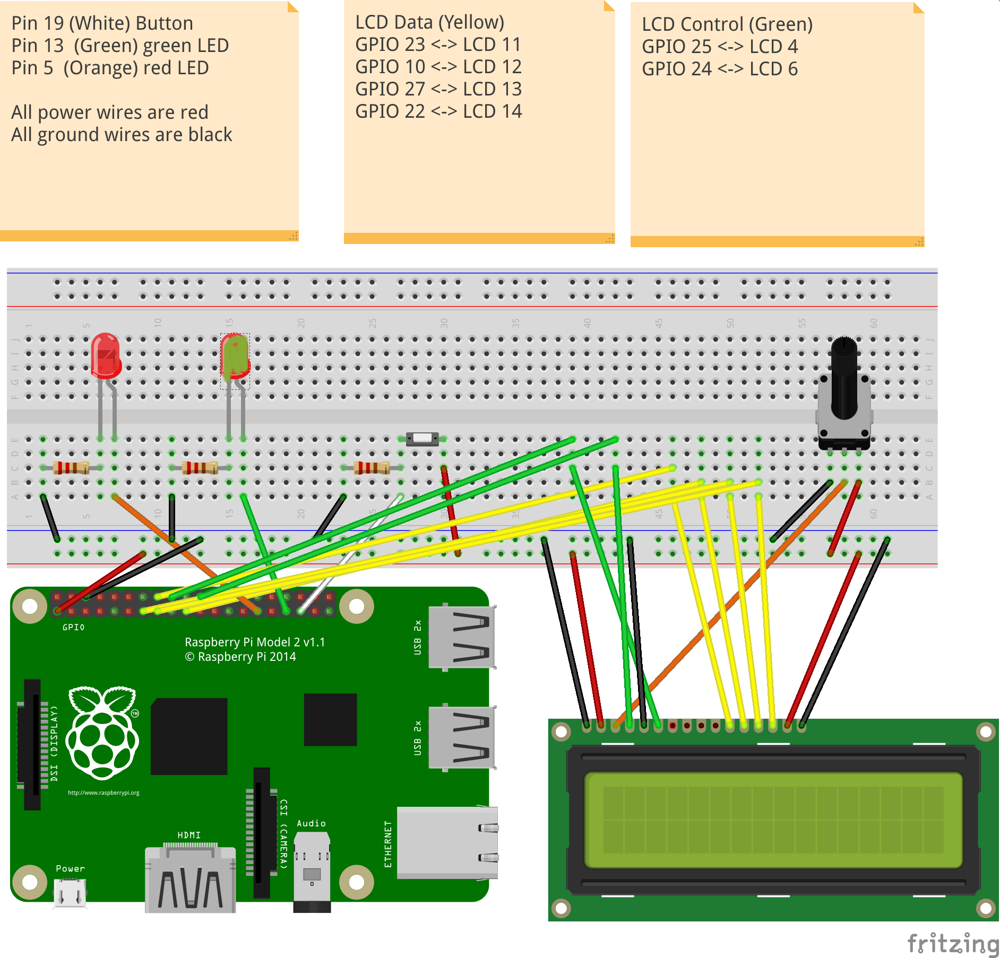

# F28HS Coursework 2: Mastermind Game on Raspberry Pi

This repository contains the implementation of a Mastermind game using C and ARM Assembler on a Raspberry Pi 3, as part of the F28HS "Hardware-Software Interface" course.

## Project Overview

The goal of this project is to implement a simplified version of the Mastermind board game. The game generates a random sequence of colored pegs, and the player attempts to guess the sequence using a button input. Feedback on the guesses (exact matches and approximate matches) is provided via LEDs (Green and Red) and displayed on a 16x2 LCD display.

### Features

- Generates a random sequence of 3 colors for the player to guess.
- Displays game information and feedback on a 16x2 LCD display.
- Uses LEDs (Green and Red) for visual feedback on exact and approximate matches.
- Limits the game to a maximum of 10 attempts per round.
- Provides success or failure messages based on the player's ability to guess the sequence.

## Hardware Setup

The following components are used in this project:
- Raspberry Pi 3
- 16x2 LCD Display
- Two LEDs (Red and Green)
- Button for user input
- Potentiometer for LCD contrast adjustment

### Wiring Diagram

### GPIO Pin Connections
- **Green LED**: GPIO pin 13
- **Red LED**: GPIO pin 5
- **Button**: GPIO pin 19
- **LCD Display**: Connected as per the Fritzing diagram, with contrast controlled by a potentiometer.

## Getting Started

1. **Clone the Repository**: Fork and clone this repository to your local machine.

2. **Compile and Run**:
   - Compile the C and ARM Assembler files using the provided Makefile.
   - Execute the main program (`master-mind.c`) to run the Mastermind game on your Raspberry Pi.

3. **Testing**:
   - Use `make unit` to run unit tests on the ARM Assembler implementation of the matching function (`mm-matches.s`).
   - Execute `sh ./test.sh` to perform unit tests on the C implementation against the Assembler implementation.

## Code Structure

### Files Included:
- `master-mind.c`: Main C program for implementing the game logic.
- `mm-matches.s`: ARM Assembler implementation of the matching function.
- `lcdBinary.c`: Inline Assembler code for low-level hardware interaction (LEDs, button, LCD).
- `testm.c`: Testing function to validate C and Assembler implementations of the matching function.
- `test.sh`: Shell script for unit testing the matching function.

### Compilation and Execution:
- Compile with `make all` to build the main program and test functions.
- Run the game in debug mode with `make run`.
- Perform unit testing with `make unit` or compare C vs Assembler versions with `make test`.

### Integration:
- Integrate the C program with the ARM Assembler code (`mm-matches.s`) for the matching function.
- Utilize inline Assembler (`lcdBinary.c`) for direct hardware control of LEDs, button, and LCD display.

## Conclusion

This coursework provided practical experience in systems programming, integrating C and ARM Assembler on the Raspberry Pi platform. It involved low-level hardware interaction and synchronization using timers and GPIO pins. The project enhanced understanding of hardware-software interfaces and embedded systems development.

For detailed implementation and function descriptions, refer to the source code files (`master-mind.c`, `mm-matches.s`, `lcdBinary.c`) and accompanying comments.
